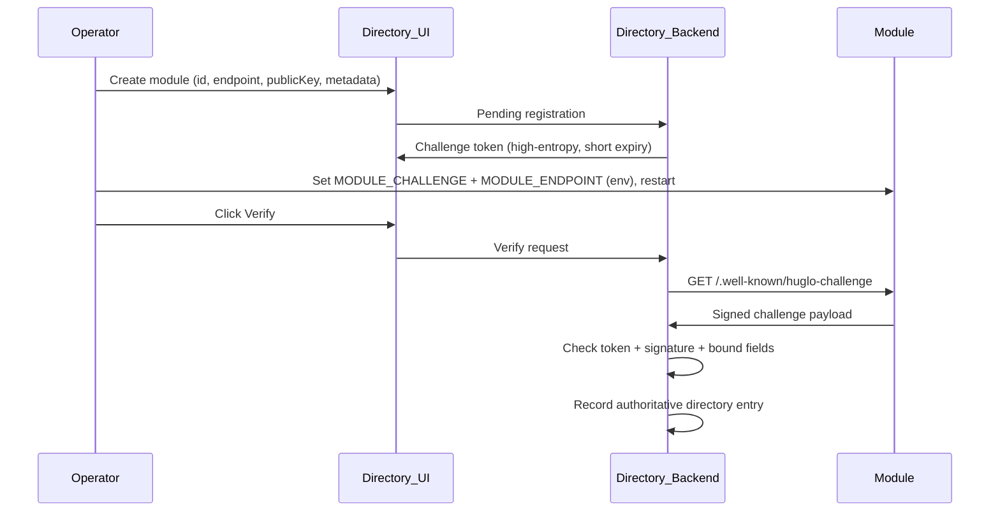
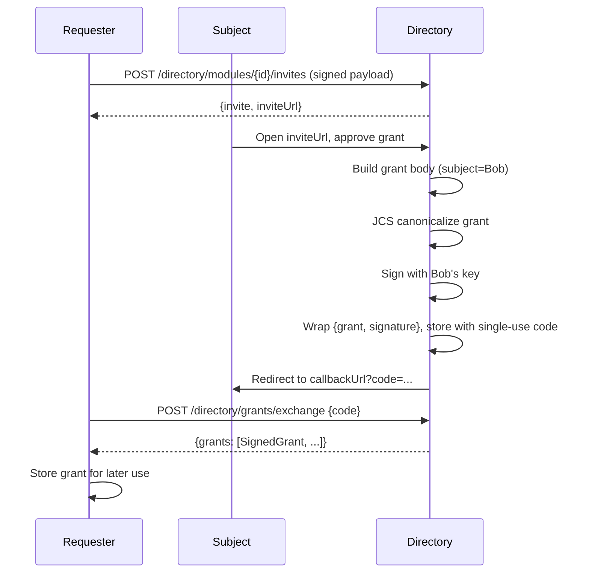

# Huglo Module Protocol Specification

This document describes the **Huglo federation protocol** for module-to-module communication. Modules publish capabilities, discover one another through a directory, and exchange signed HTTP requests.

The default directory provider is Huglo. Modules can also use any compatible custom identity provider that implements the endpoints and signing semantics in this document. The provider supplies the trust layer: identities, public keys, module ownership verification, grants, and revocations.

The primary runtime flow is requester module → holder module over `POST /invoke/:scope`. Directory endpoints support that flow with discovery, keys, grants, revocation, and registration challenges.

---

## Purpose

Modules use the SDK to publish capabilities, discover one another, and exchange signed HTTP requests. The directory provider supplies trust material: module endpoints, public keys, user keys, grants, and revocations.

The protocol supports:
- module discovery through a directory;
- module ownership verification before listing;
- user authorization for requester modules to access holder-module scopes;
- holder verification of caller identity, grant validity, scope binding, revocation status, and payload schema;
- open scopes that authenticate the requester module with a signed requester envelope;
- custom identity providers that implement the same directory API.

## Key concepts

- **Directory provider** — the service that publishes module endpoints, module public keys, user public keys, grant revocations, and grant invite/exchange endpoints.
- **Module** — an HTTP service with a stable module id, Ed25519 keypair, manifest, and one or more callable scopes.
- **Scope** — a named capability exposed by a holder module. Protected scopes use signed grants; open scopes use signed requester envelopes.
- **Grant** — a signed authorization saying that an author permits a requester module to call a holder module's scope for a subject.
- **Manifest** — a public description of a module's id, metadata, public key, scopes, optional flow type descriptors (`types[]`), optional configuration contract, and emitters.
- **Invite** — a signed requester intent that asks the directory provider to start user approval and grant issuance.
- **Revocation list** — the current set of grant ids that holders must reject.
- **Canonical JSON** — every signature uses RFC 8785 canonicalization so independent parties sign and verify the same bytes.

The directory provider is configurable. The SDK resolves the directory URL in this order:
1. `new Module({ huglo: { directoryUrl } })`
2. `HUGLO_DIRECTORY_URL`
3. the SDK default public Huglo directory

Modules can run against Huglo's hosted directory or a custom compatible identity provider. A compatible provider implements the directory API described below.

## Protocol paths

### Module paths

| Method | Path | Purpose |
|--------|------|---------|
| GET | `/health` | Basic module health check. |
| GET | `/manifest` | Public module manifest: metadata, public key, scopes, emitters, optional `types[]` (registered flow port types), and optional config metadata. See [STRUCTURAL_TYPES.md](./STRUCTURAL_TYPES.md). |
| GET | `/.well-known/huglo-challenge` | Signed ownership challenge response used during module registration. |
| POST | `/invoke/:scope` | Main module-to-module invocation endpoint for protected and open scopes. |
| GET | `/grant/init` | Optional helper path for starting grant authorization flows. Derived from the callback path when customized. |
| GET | `/grant/callback` | Optional grant-code callback path for exchanging and saving approved grants. Customizable. |
| GET | `/config` | Optional module configuration UI path when config support is enabled. Customizable. |
| GET | `/config/login` | Optional config login start path. |
| GET | `/config/callback` | Optional config OAuth callback path. |
| POST | `/config/intake` | Optional config submission path. |
| DELETE | `/config/instances/:instanceId` | Optional config instance deletion path. |
| GET | `/file/:token` | Optional short-lived file download path. |
| GET | `/assets/*` | Optional static asset path when a module serves bundled assets. |
| GET | `/metrics` | Optional Prometheus metrics endpoint. |
| Any | `/api/*` | Optional namespace for module-defined custom routes. |

### Supporting directory paths

| Method | Path | Purpose |
|--------|------|---------|
| GET | `/directory/modules/{moduleId}` | Resolve a module endpoint and public key. |
| GET | `/directory/modules/{moduleId}/keys/{keyId}` | Resolve a versioned module key (future rotation support). |
| GET | `/directory/users/{userId}/key` | Resolve a user public key. |
| GET | `/directory/users/{userId}/keys/{keyId}` | Resolve a versioned user key (future rotation support). |
| GET | `/directory/revocations` | Fetch revoked grant ids. |
| POST | `/directory/modules/{moduleId}/invites` | Create a grant invite from a signed requester payload. |
| POST | `/directory/grants/exchange` | Exchange a single-use code for signed grants. |

---

## 1. Roles and identifiers

| Role | Identifier format | Example |
|------|-------------------|---------|
| Subject (user) | `huglo:user:<userId>` | `huglo:user:abc123` |
| Holder (module) | bare module id | `trovi` |
| Requester (module) | bare module id | `billing` |

- **Subject** — the user whose data is concerned. The subject's key signs grants.
- **Holder** — the module that holds data or performs an action; it verifies and serves invoke requests.
- **Requester** — the module making the call; it signs the request.

---

## 2. Cryptography contract

The directory and modules must agree exactly on the following.

### 2.1 Algorithm
- **Ed25519** for all signatures (grants, module requests/responses, registration challenge).

### 2.2 Public key encoding
- Public keys are exchanged as **base64 of the raw 32-byte Ed25519 public key** (no PEM, no SPKI wrapper on the wire).
- API helpers may convert keys to and from SPKI. The wire format is the raw 32-byte form, base64-encoded.

### 2.3 Signature string format
```
ed25519:<base64Signature>
ed25519:<keyId>:<base64Signature>   // optional key-version form (rotation; future)
```
- Implementations parse both forms. The plain `ed25519:<base64>` form is used today. The `keyId` slot is reserved for key rotation (see §8).

### 2.4 Canonicalization
- Every signature is computed over the **RFC 8785 (JCS)** canonical JSON serialization of the relevant **parsed object**.
- Both signer and verifier canonicalize independently.
- The signature is always a **sibling** of the object it covers and covers **everything except itself**.
- **Numeric values in signed payloads must be integers or strings** (avoids number-format divergence).

---

## 3. Directory API

These endpoints support module-to-module calls by providing discovery, key lookup, grant exchange, and revocation checks. Modules call them against `directoryUrl`. That URL can point to Huglo's hosted directory or to any custom compatible identity provider. Configure it with `new Module({ huglo: { directoryUrl } })` or the `HUGLO_DIRECTORY_URL` environment variable. All responses are JSON.

### 3.1 Get module entry
```
GET /directory/modules/{moduleId}
```
Response `200`:
```json
{
  "moduleId": "trovi",
  "endpoint": "https://trovi.example.com",
  "publicKey": "<base64 raw 32-byte Ed25519 public key>"
}
```
- Resolves both the module's **public key** (to verify Sig 2 / Sig 3) and its **base endpoint URL** (for outbound calls).
- Only **verified and approved** modules should be returned here.

### 3.2 Get module key by version (rotation; future)
```
GET /directory/modules/{moduleId}/keys/{keyId}
```
Response: same shape as §3.1. Used when key rotation is implemented. May return `404` until then.

### 3.3 Get user public key
```
GET /directory/users/{userId}/key
```
- `{userId}` is the **bare** id, without the `huglo:user:` prefix.

Response `200`:
```json
{
  "userId": "abc123",
  "publicKey": "<base64 raw 32-byte Ed25519 public key>"
}
```
- Used by holders to verify **Sig 1** (the grant signature) when `author` is a user.

### 3.4 Get user key by version (rotation; future)
```
GET /directory/users/{userId}/keys/{keyId}
```
Response: same shape as §3.3. Optional until rotation.

### 3.5 Revocation list
```
GET /directory/revocations
```
Response `200`:
```json
{ "grantIds": ["g-7f3a9c2e-...", "g-..."] }
```
- Clients cache this and refresh periodically (default ~60s). Return the **full set** of currently-revoked grant ids.

### 3.6 Error and availability behavior
- Non-`2xx` directory responses are treated as directory errors and the module **fails closed**.
- Keys/endpoints are cached by clients (default TTL 5 min) and the revocation list is refreshed periodically (~60s).
- If the directory is unreachable and no cached value is available, the module rejects the request.

---

## 4. Module registration (ACME-style ownership proof)

Registration is initiated by the directory provider's module onboarding flow. Two things are proven before a module is listed:

1. The registrant **controls the endpoint** they claim.
2. The registrant **holds the private key** matching the submitted public key.

### 4.1 Flow



### 4.2 Challenge issuance
- On pending registration, generate a **random high-entropy token** bound to `{moduleId, endpoint, publicKey}` with a **short expiry**.
- Return the token to the operator so they can configure the module (`MODULE_CHALLENGE`).

### 4.3 Challenge verification (directory fetches the module)
```
GET {endpoint}/.well-known/huglo-challenge
```
The module returns:
```json
{
  "payload": {
    "challenge": "<token issued at registration>",
    "moduleId": "trovi",
    "endpoint": "https://trovi.example.com",
    "publicKey": "<base64 raw 32-byte Ed25519 public key>"
  },
  "signature": "ed25519:<base64 over JCS(payload)>"
}
```
Verification requires all of:
1. `payload.challenge` equals the issued token for this pending registration (proves **endpoint control**).
2. `signature` verifies against the **submitted** public key over `JCS(payload)` (proves **key possession**).
3. `payload.moduleId`, `payload.endpoint`, `payload.publicKey` match the pending registration (anti-replay binding).
4. The challenge has not expired.

### 4.4 On success
- Record the authoritative directory entry: `moduleId → { endpoint, publicKey }`.
- The **directory public key is authoritative** for verification.
- Listing requires approval; see §5.

### 4.5 Module metadata
Captured during onboarding and surfaced in the marketplace:
- name, description, marketing assets
- pricing, privacy policy + ToS links
- operator/company information

---

## 5. Marketplace listing and approval

1. After ownership verification, an administrator approves the module (guards against malicious or false modules).
2. On approval, the module is **listed in the marketplace** for users to install.
3. Only approved modules appear in directory lookups (§3.1) for production use.

---

## 6. Identity and key management

- Subject identity keys are managed by the directory, which signs grants on a subject's behalf.
- Any user's **public key** is served by user id via §3.3.
- Verifying parties cache fetched public keys locally.

---

## 7. Grant issuance

A grant is a subject's signed authorization. The directory builds, signs, stores, and hands out grants.

### 7.1 Grant wire shape
```json
{
  "grant": {
    "grant_id": "g-7f3a9c2e-...",
    "holder": "trovi",
    "scope": "invoices:write",
    "subject": "huglo:user:abc123",
    "requester": "billing",
    "author": "huglo:user:abc123",
    "constraints": {},
    "issued_at": "2026-05-29T20:00:00Z",
    "expires_at": "2026-06-29T20:00:00Z"
  },
  "signature": "ed25519:<base64 over JCS(grant)>"
}
```
Read as: **author** authorizes **requester** to use **scope** at **holder**, concerning **subject**'s data.

Field rules:
- `subject` and `author` must be `huglo:user:<id>` (bare module ids or other identifier forms are rejected).
- `author` must equal `subject` (user self-authorization only; holders reject mismatches with `grant_author_mismatch`).
- **Future:** delegated authorization may allow `author !== subject` when accompanied by a signed delegation proof from the subject. That is not part of the current protocol; holders reject non-user identifiers and mismatched author/subject today.
- `holder`, `requester` are bare module ids.
- `constraints` is **reserved**; empty `{}` means no restriction. Holders reject any unrecognized constraint key (fail closed), so constraints should only be emitted once modules support them.
- `issued_at` / `expires_at` are ISO 8601.
- `signature` is Ed25519 over `JCS(grant)` using the **subject/author's** signing key.

### 7.2 Create invite (requester module)

The requester module creates an authorization invite through the directory. The requester signs the payload with its module private key.

```
POST /directory/modules/{moduleId}/invites
Content-Type: application/json

{
  "payload": {
    "moduleId": "billing",
    "callbackUrl": "https://billing.example/oauth/callback",
    "scopes": [
      { "holder": "trovi", "scope": "invoices:write" }
    ],
    "constraints": {},
    "iat": "2026-05-29T22:00:00.000Z"
  },
  "signature": "ed25519:<base64 over JCS(payload)>"
}
```

Response `200`:
```json
{
  "invite": {
    "id": "string",
    "requesterModuleId": "string",
    "callbackUrl": "string",
    "constraints": {},
    "expiresAt": "2026-05-29T23:33:22.698Z",
    "createdByUserId": "string",
    "active": true,
    "createdAt": "2026-05-29T23:33:22.698Z",
    "updatedAt": "2026-05-29T23:33:22.698Z",
    "scopes": [
      { "id": "string", "inviteId": "string", "holder": "string", "scope": "string" }
    ]
  },
  "inviteUrl": "https://<directory>/invite/..."
}
```

The directory verifies:
- `signature` over `JCS(payload)` using the requester module's public key from the directory.
- `payload.moduleId` matches the path `{moduleId}`.
- An `inviteUrl` is returned for the subject to open in a browser and approve.

### 7.3 Issuance flow (subject approves)



Flow steps:
1. **Create invite** — accept the signed invite payload from the requester module (§7.2).
2. **Approval UI** — subject opens `inviteUrl`, reviews and approves.
3. **Build grant body** with the subject's user id as `subject`.
4. **Canonicalize** the grant via JCS (RFC 8785).
5. **Sign** with the subject's authorized key.
6. **Wrap** `{ grant, signature }`, store in a grant registry with a **single-use code**.
7. **Redirect** to `callbackUrl?code=<single-use-code>` after approval.
8. **Multi-grant approval** — multiple grants may be signed in one approval when the requester(s) are trusted.

### 7.4 Single-use code exchange

The requester exchanges the single-use code for signed grant(s):

```
POST /directory/grants/exchange
Content-Type: application/json

{ "code": "<single-use code>" }
```

Response `200`:
```json
{
  "grants": [
    {
      "grant": { ... },
      "signature": "ed25519:<base64>"
    }
  ]
}
```

- The code must be **single-use** and short-lived.
- Each grant object must match §7.1.
- After exchange, the requester stores the grant(s) and later passes one to `module.call({ grant, ... })`.

### 7.5 Revocation
- When a grant is revoked, add its `grant_id` to the list served at §3.5.
- Holders check this on every invoke and reject revoked grants.

### 7.6 Config identity proof

When a host opens a module config popup, the directory mints a short-lived **config identity proof** so the module can bind each config instance to a verifiable Huglo subject at save time (**session B**). This federation binding does not depend on how the module implements its own config UI login (**session A**).

**Two sessions:**

| Session | Role | Managed (`module.config()`) | Custom (`customConfig()`) |
|---------|------|------------------------------|---------------------------|
| **A — Module account** | UI tenancy (list/edit/delete in config UI) | Required: Huglo OAuth cookie on `POST /config/intake` (401 without) | Developer-defined auth (optional); SDK does not impose session A |
| **B — Configuration** | Stamps `directorySubject` on save | Required: `configProof` in intake body | Required: verified `configProof` on custom save route |

Session A and B are **independent**. Invoke enforcement uses only session B (`directorySubject`).

#### 7.6.1 Proof wire shape

```json
{
  "assertion": {
    "subject": "huglo:user:abc123",
    "audience": "holder-module-id",
    "purpose": "config",
    "nonce": "9f2c…",
    "issued_at": "2026-06-07T16:40:00.000Z",
    "expires_at": "2026-06-07T16:45:00.000Z"
  },
  "signature": "ed25519:<base64 over JCS(assertion)>"
}
```

- `subject` — the Huglo user configuring the module (same namespace as grant `subject`).
- `audience` — holder module id the proof is minted for (prevents cross-module replay).
- `purpose` — must be `"config"`.
- `nonce` — unique id for this proof; **always generated by the directory** at mint time (`randomUUID()`). Present in the signed assertion; host must not supply it on the mint request.
- `signature` — Ed25519 over `JCS(assertion)` using the **subject's** directory key (same scheme as grant Sig 1).

#### 7.6.2 Minting (directory)

```
POST /directory/config-assertions
Cookie: <Better Auth session>

{ "audience": "holder-module-id" }
```

Request body contains **`audience` only**. The host must not send `nonce`. The directory always sets `assertion.nonce = randomUUID()` before signing. Extra fields (including `nonce`) should be rejected with `400`.

Response `200`:

```json
{ "assertion": { ... }, "signature": "ed25519:..." }
```

The directory authenticates the browser session, generates a fresh nonce, and signs with `signForUser(session.userId, assertion)`. No extra user consent click — the existing Huglo session is sufficient.

#### 7.6.3 Host → config popup transport

After the config page sends `huglo:config:ready`, the host posts:

```json
{ "configProof": { "assertion": { ... }, "signature": "..." }, "<hostProvidedField>": "..." }
```

The popup stores `configProof` as the **configuration session** (session B). This is independent of the module's own login (session A).

#### 7.6.4 Module verification at save

On config save, the module **always** requires a verified `configProof` (session B):

**Managed** `POST /config/intake` body:

```json
{
  "configProof": { "assertion": { ... }, "signature": "..." },
  "userValues": { ... },
  "hostValues": { ... },
  "instanceId": "optional-for-edit"
}
```

Also requires Huglo OAuth session A (config session cookie). Without it → `401`.

**Custom** save route: developer owns the HTTP handler; session A is optional and entirely custom. Session B (`configProof`) is still required for federation binding.

On save, the module:

1. Verifies the proof signature against `GET /directory/users/{subject}/key`.
2. Checks `purpose === "config"`, `audience === moduleId`, expiry, and nonce replay.
3. Stores `directorySubject = assertion.subject` on the config instance (required field; re-stamped on every edit with a fresh proof).

Module-account login (`subject` / session A) governs listing and UI ownership only when the module implements it.

#### 7.6.5 Module verification at invoke

On modules that use managed `configStore` (`module.config()`), **every protected scope invoke** must include `context.configInstanceId` in the request payload. Missing `configInstanceId` → `403 config_instance_required`.

The SDK loads the instance and rejects the call unless:

```
instance.directorySubject === grant.grant.subject
```

On success, the handler receives `ctx.config = { instanceId, values }`. Custom-config modules (`customConfig()`) do not get automatic invoke resolution; they must load the instance and compare `directorySubject` to `ctx.subject` manually.

---

## 8. Key rotation (future)

- The signature format reserves an optional `keyId`: `ed25519:<keyId>:<base64>`.
- The key-version endpoints (§3.2, §3.4) let verifiers request a specific key version.
- Versioned key routes may return `404` until a full rotation protocol with overlap windows is supported.

---

## 9. Open scopes

Modules may register grant-free scopes with `"open": true` in the manifest. Open scopes authenticate the requester module directly.

- **Request envelope:** `{ payload, requester, scope, timestamp, nonce, requesterSignature }` — no `grant` field.
- **Sig 2:** `JCS({ payload, requester, scope, timestamp, nonce })` signed by the requester module.
- **Holder verification:** parse → timestamp → nonce → Sig 2 → scope binding → input schema (no Sig 1, grant window, constraints, or revocation).
- **Caller identity:** the requester module is authenticated via Sig 2 and the directory.
- **Mismatch errors:** a grant envelope on an open scope → `grant_not_expected`; an open envelope on a protected scope → `grant_required`.

---

## 10. Module-side verification and signing

Modules verify inbound calls, sign outbound calls, and verify signed responses. The directory supplies keys, endpoints, grants, and revocations.

- Holder verification on `POST /invoke/:scope` — **protected scopes:** parse envelope → timestamp (±5 min) → nonce replay → Sig 2 (requester) → author/subject binding → Sig 1 (grant) → grant validity window → binding checks (holder/scope/requester) → constraints (fail closed) → revocation → input schema. **Open scopes:** parse open envelope → timestamp → nonce → Sig 2 → scope binding → input schema (see §9).
- Requester calls build the envelope, sign Sig 2, verify the holder's Sig 3, and match `requestId`.
- Invite and grant exchange calls use the directory endpoints in §7.
- Responses, including errors, are signed by the holder module.

---

## 11. Directory API summary

| Method | Path | Purpose | Status |
|--------|------|---------|--------|
| GET | `/directory/modules/{moduleId}` | Module endpoint + public key | Yes |
| GET | `/directory/modules/{moduleId}/keys/{keyId}` | Versioned module key | Future |
| GET | `/directory/users/{userId}/key` | User public key | Yes |
| GET | `/directory/users/{userId}/keys/{keyId}` | Versioned user key | Future |
| GET | `/directory/revocations` | Revoked grant ids | Yes |
| POST | `/directory/modules/{moduleId}/invites` | Create grant invite (signed payload) | Yes |
| POST | `/directory/grants/exchange` | Single-use code → signed grants | Yes |
| POST | `/directory/config-assertions` | Mint config identity proof (session-gated) | Yes |
