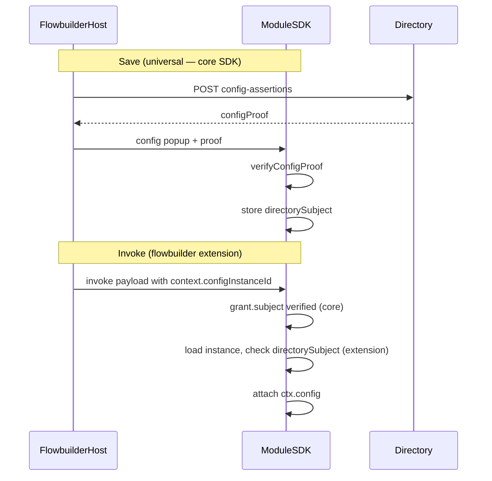

# `@huglo/module-sdk-flowbuilder` (planned)

This document tracks work to extract **flowbuilder-specific** conventions from core `@huglo/module-sdk` into a separate extension package. Core SDK should remain host-agnostic federation + module runtime; flowbuilder wiring lives here.

Related: [CONFIG_IDENTITY_PROOF.md](./CONFIG_IDENTITY_PROOF.md), [HUGLO_SPECIFICATION.md](./HUGLO_SPECIFICATION.md) §7.6.

## Problem

Core SDK currently embeds flowbuilder-shaped assumptions:

- Invoke auto-resolution reads `input.context.configInstanceId` ([`src/server.ts`](src/server.ts) — `extractConfigInstanceId`, `resolveInvokeConfigContext`)
- `ctx.config` injection depends on that path ([`src/verify.ts`](src/verify.ts))
- `FlowNodeContext` / Zod schema duplicated in **foaf-flowbuilder-api** and module repos (e.g. **email-sender**)

Config **save** security is universal (`verifyConfigProof` → `directorySubject`). Config **invoke** wiring (“which instance ID did the host pass?”) is platform-specific and should not live in core.

## Package boundary

### Stays in core `@huglo/module-sdk`

| Piece | Why |
|-------|-----|
| `verifyConfigProof` | Directory-signed federation protocol; modules verify at save |
| Managed `/config/intake` + `directorySubject` on `InstanceConfig` | Module-side save verification |
| `openConfigPopup({ configUrl, configProof, hostValues?, onSaved })` | Host-agnostic popup handshake (no flow/node topology) |
| `ConfigStore`, managed config UI/routes | Module config storage and UI |
| Grant verification, invoke envelope, scopes | Universal federation |

### Moves to `@huglo/module-sdk-flowbuilder`

| Piece | Current location | Notes |
|-------|------------------|-------|
| `FlowNodeContext` type | `foaf-flowbuilder-api/src/engine/flowNodeContext.ts` | `flowId`, `nodeId`, `configInstanceId?` |
| `FlowNodeContextSchema` (Zod) | `email-sender/src/lib/schemas.ts` (duplicated) | Shared schema for scope inputs |
| `buildFlowNodeContext`, `injectFlowNodeContext` | `foaf-flowbuilder-api/src/engine/flowNodeContext.ts` | Runtime inject at invoke |
| `extractConfigInstanceId` | `module-sdk/src/server.ts` | Hardcoded `input.context.configInstanceId` |
| `resolveInvokeConfigContext` | `module-sdk/src/server.ts` | Load instance + `directorySubject === grant.subject` + attach `ctx.config` |
| Invoke metrics outcomes `config_not_found`, `config_subject_mismatch` | `module-sdk/src/metrics.ts` | Optional: keep in core or move with extension |
| Flowbuilder Configure helpers | Platform frontend + TASKS docs | Optional thin wrapper around core `openConfigPopup` |

## Two moments of config security



| Moment | Question answered | Owner |
|--------|-------------------|-------|
| **Save** | Which Huglo subject owns this config instance? | Core — `verifyConfigProof` → `directorySubject` |
| **Invoke** | Which instance is this call using, and does it match the grant subject? | Extension — requires host to pass instance ID |

Without the extension, modules must enforce invoke themselves (see [`examples/custom-config/index.ts`](examples/custom-config/index.ts): load by ID from **their own** input schema, compare `directorySubject !== ctx.subject`).

## Temporary state in core (remove after extension exists)

Marked `TODO(module-sdk-extensions)` in [`src/server.ts`](src/server.ts):

1. `if (options.configStore) { resolveInvokeConfigContext(...) }` in `/invoke/:scope`
2. `resolveInvokeConfigContext`
3. `extractConfigInstanceId`

**Do not add new flowbuilder conventions to core.** New platform wiring goes in the extension package.

## Proposed extension API (sketch)

```typescript
// @huglo/module-sdk-flowbuilder

export const FlowNodeContextSchema = z.object({
  flowId: z.string().min(1),
  nodeId: z.string().min(1),
  configInstanceId: z.string().min(1).optional(),
});

export type FlowNodeContext = z.infer<typeof FlowNodeContextSchema>;

export function buildFlowNodeContext(
  flowId: string,
  nodeId: string,
  configInstanceId?: string,
): FlowNodeContext;

export function injectFlowNodeContext(
  inputs: Record<string, unknown>,
  context: FlowNodeContext,
): Record<string, unknown>;

export function extractConfigInstanceId(input: unknown): string | undefined;

export async function resolveInvokeConfigContext(
  configStore: ConfigStore,
  verified: VerifiedInvokeContext<unknown>,
): Promise<InvokeConfigResolveResult>;

/** Register invoke middleware on a Module server (replaces core auto-resolution). */
export function mountFlowbuilderInvokeConfig(options: {
  configStore: ConfigStore;
}): void;
```

Exact export names TBD when the package is created. Dependency: `@huglo/module-sdk` (peer).

## Migration tasks

### 1. Create `@huglo/module-sdk-flowbuilder`

- [ ] New repo/package under `@huglo`
- [ ] Move/consolidate `FlowNodeContext` type + Zod schema + build/inject helpers
- [ ] Move invoke config resolution from core `server.ts`
- [ ] Document integration: extension registers hook; core invoke pipeline calls it when configured

### 2. Core `@huglo/module-sdk`

- [ ] Remove `extractConfigInstanceId`, `resolveInvokeConfigContext`, and auto `ctx.config` injection from `server.ts`
- [ ] Keep `ctx.config` **type** on verified context (optional field modules/extensions may set)
- [ ] Update [CONFIG_IDENTITY_PROOF.md](./CONFIG_IDENTITY_PROOF.md) — invoke auto-enforce row points to extension
- [ ] Update tests: invoke config enforcement tests move to extension or use extension in integration tests

### 3. `foaf-flowbuilder-api`

- [ ] Replace local `flowNodeContext.ts` with import from `@huglo/module-sdk-flowbuilder`
- [ ] Update [TASKS-config-proof.md](../foaf-flowbuilder-api/TASKS-config-proof.md) examples

### 4. Module repos (e.g. `email-sender`)

- [ ] Import `FlowNodeContextSchema` from extension instead of local copy
- [ ] Remove manual `instance.subject !== subject` in `smtp-config.ts` (wrong field — session A)
- [ ] Use `directorySubject` + extension invoke resolution or `ctx.config`
- [ ] Ensure saves go through proof path so `directorySubject` is stamped

### 5. Platform frontend

- [ ] Configure flow: fetch proof → `openConfigPopup({ configProof, ... })` (core SDK)
- [ ] Persist returned `instanceId` on node → passed as `context.configInstanceId` at invoke (extension convention)

## What not to move

- **`verifyConfigProof`** — not flowbuilder-specific; any host with directory session can mint proof
- **`openConfigPopup`** — host-agnostic; already stripped of `flowId`/`nodeId`
- **Managed config routes / proof at intake** — module concern, not platform topology

## References

| Repo | Relevant files |
|------|----------------|
| module-sdk | `src/server.ts`, `src/config-proof.ts`, `src/config-routes.ts`, `src/config-opener.ts` |
| foaf-flowbuilder-api | `src/engine/flowNodeContext.ts`, `src/temporal/activities.ts`, `TASKS-config-proof.md` |
| email-sender | `src/lib/schemas.ts` (`FlowNodeContextSchema`), `src/services/smtp-config.ts` |
